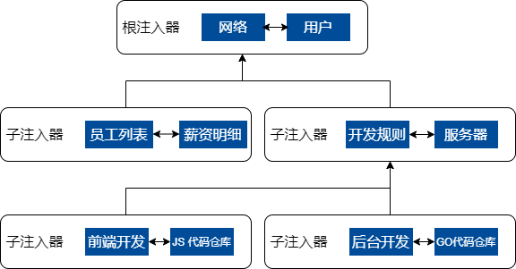
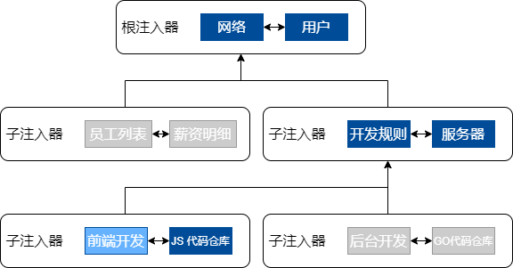

依赖注入库 - DI
==================================================================

IoC（Inversion of Control）控制反转，是面向对象编程中的一种设计原则，用来降低计算机代码之间的耦合度，而 DI 则是实现IOC的一种实现技术，简单来说就是我们将依赖注入给调用方，而不需要调用方来主动获取依赖。  


## 安装
```
npm install @tanbo/di reflect-metadata
```

## 基本使用

要实现依赖注入，首先需要用 `Injectable` 标识一个类是可注入的，再把这个类添加到 `ReflectiveInjector` 容器（也可以叫注入器）内，然后通过 `ReflectiveInjector` 实例的 `get` 方法，就可以获取容器内，任意类的实例了。

```typescript
import 'reflect-metadata';
import { Injectable, ReflectiveInjector } from '@tanbo/di';

// 声明类是可注入的
@Injectable()
class Child {
  name = 'child'
  index: number
  constructor() {}
}

// 声明类是可注入的
@Injectable()
class Parent {
  name = 'parent'
  constructor(public child: Child) {
  }
}

// 创建容器
const injector = new ReflectiveInjector(null, [Parent, Child]);

// 获取实例
const instance = injector.get(Parent);
console.log(instance);
```

## 如何注入其它数据

在实际应用中，很多时候不仅仅只需要注入类的实例，可能还需要注入其它数据，但通过 Typescript 自动解析元数据，是无法获取到相关依赖信息的。这时，就需要通过指定 token 的方式实现。

```typescript
import { Injectable, InjectionToken, Inject, ReflectiveInjector } from '@tanbo/di';

interface UserInfo {
  name: string;
}

const UserInfoInjectionToken = new InjectionToken<UserInfo>('UserInfoInjectionToken');

@Injectable()
class User {
  constructor(@Inject(UserInfoInjectionToken) public userInfo: UserInfo) {
  }
}

const injector = new ReflectiveInjector(null, [
  User, {
    provide: UserInfoInjectionToken,
    useValue: {
      name: '张三'
    }
  }
]);

const instance = injector.get(User);
```

## 多级注入器

在简单的场景中，一个容器就可以满足我们的需求，但当应用越来越复杂时，我们就需要根据不同的作用域，来实现访问控制了。

比如，我们希望全局有一些基础的类，在任意类都能注入，还有另外一些类，会根据用户角色的不同，只能访问特定的类。如下图，我们把图中所有的小方块当作类，它们的访问关系是这样的。



如图所示，每个类都可以访问当前容器的兄弟类或上层容器的类。在实际的代码组织中，我们只需要给一个容器指定一个父容器，就可以了。

```typescript
import { ReflectiveInjector } from './reflective-injector';

const rootInjector = new ReflectiveInjector(null, [
  网络,
  用户
])

const middleInjector1 = new ReflectiveInjector(rootInjector, [
  员工列表,
  薪资明细
])

const middleInjector2 = new ReflectiveInjector(rootInjector, [
  开发规则,
  服务器
])

const leafInjector1 = new ReflectiveInjector(middleInjector2, [
  前端开发,
  JS代码仓库
])

const leafInjector2 = new ReflectiveInjector(middleInjector2, [
  后台开发,
  GO代码仓库
])
```

通过如上的代码组织，我们实现了示例图中的注入树结构。那么 `前端开发` 这个类，可以注入哪些类呢？如前面文档所述，可以注入以下类：



## Provider 示例

在上面的示例中，我们看到了我们不但可以注入类的实例，也可以通过 `useValue` 的方式，直接注入一个值。使用 `useValue` 的这种方式，我们叫做 ValueProvider。在 @tanbo/di 中，我们还有更多方法来提供一个可注入的对象。

### useValue

`ValueProvider` 可以让我们把任意值注入到类中，常用在一些全局配置对象，或需要注入非类实例的对象或数据的场景。

```typescript
import { Injectable, InjectionToken, Inject, ReflectiveInjector } from '@tanbo/di';

const PathInjectionToken = new InjectionToken<string>('PathInjectionToken')

@Injectable()
class HttpExample {
  constructor(@Inject(PathInjectionToken) public path: string) {
  }
}

const injector = new ReflectiveInjector(null, [
  HttpExample,
  {
    provide: PathInjectionToken,
    useValue: '/api'
  }
])

const http = injector.get(HttpExample)
console.log(http)
```

### classProvider

`classProvider` 可以让我们用一个类来替换另一个类，通常是原程序的注入参数依赖于一个抽象类，再由我们提供一个实现类去实现具体的逻辑和功能。

```typescript
// 原程序
import { Injectable, InjectionToken, Inject, ReflectiveInjector } from '@tanbo/di';

@Injectable()
abstract class Dialog {
  abstract show(el: Element): Promise<boolean>
}

@Injectable()
class User {
  constructor(private dialog: Dialog) {
  }
  
  login() {
    const dialogElement = document.createElement('div')
    // dialog ui 及交互实现...
    this.dialog.show(dialogElement).then(isLogin => {
      console.log(isLogin)
    })
  }
}
```

```typescript
// 实现 Dialog
import { Injectable, InjectionToken, Inject, ReflectiveInjector } from '@tanbo/di';

@Injectable()
class MyDialog implements Dialog {
  show(el: Element): Promise<boolean> {
    let isLogin = false
    // dialog 逻辑实现...
    
    return Promise.resolve(isLogin)
  }
}

const injector = new ReflectiveInjector(null, [
  User,
  {
    provide: Dialog,
    useClass: MyDialog
  }
])

const user = injector.get(User)
user.login()
```

### useFactory

`FactoryProvider` 可以让我们使用一个函数的返回值当作注入参数，注入到类中。

```typescript
@Injectable()
class Http {
  constructor(private config: HttpConfig) {
  }
}

const injector = new ReflectiveInjector(null, [
  Http,
  {
    provide: HttpConfig,
    useFactory() {
      return {
        baseURI: '/api',
        timeout: 5000
      }
    }
  }
])
```

如果 `useFactory` 参数的内部依赖于其它类，我们还可以通过声明 `deps` 依赖参数数组，让注入器在调用时，自动把相关的依赖传进来。
```typescript
@Injectable()
class Http {
  constructor(private config: HttpConfig) {
  }
}

const injector = new ReflectiveInjector(null, [
  App,
  Http,
  {
    provide: HttpConfig,
    useFactory(app: App) {
      return {
        baseURI: app.isTest ? '/test/api' : '/api',
        timeout: 5000
      }
    },
    deps: [App]
  }
])
```

## 依赖注入规则声明

我们除了可以在类的构造函数中，注入一个另一个类，我们还可以同时声明，让注入器按照一定的规则来注入，以适应更多的场景。

### Optional

如果我们的注入参数是可选的，我们可以声明 Optional 来让注入器在注入器树上找不到相关依赖时，并不抛出异常，而是注入一个 null。
> 这种场景特别适合那种我们提供一个最基础的能力，如果用户有更好的，我们就用更好的。

```typescript
@Injectable()
class Example {
  constructor(@Optional() private http: Http) {
    if (!this.http) {
      this.http = new XMLHttpRequest()
    }
  }
}
```

### Self

由于注入器是根据就近原则，依次在注入器树上查找相关类实例的，如果我们想要注入器在查找时，锁定在当前容器内查找，则可以通过 Self 装饰器来声明：

```typescript
@Injectable()
class Example {
  constructor(@Self() private http: Http) {
  }
}
```

### SkipSelf

当然，如果查找时，你不想从当前容器内查找，而是想要从上一层容器开始查找，则可以通过 SkipSelf 装饰器来声明：

```typescript
@Injectable()
class Example {
  constructor(@SkipSelf() private http: Http) {
  }
}
```

### Inject

你还可以通过 Inject 装饰器指定注入 token，而不是通过参数类型。

```typescript
@Injectable()
class Example {
  constructor(@Inject(MyHttp) private http: Http) {
  }
}
```

当模块引用关系复杂时，我们需要注入的类，会在我们当前类后面才声明，这时会导致当前类在获取元数据时，拿不到类型，这时，我们也可以通过如下方式解决：

```typescript
@Injectable()
class Example {
  constructor(@Inject(forwardRef(() => Http)) private http: Http) {
  }
}
```

> 需要说明的是，你可以自由组合上面的装饰器。而不仅限于一个。

### 

## deps 参数详解

在上面的示例中，我们看到了在使用 `FactoryProvider` 时，可以用 `deps` 声明依赖参数。实际上，在 `ClassProvder`、`ConstructorProvider` 中，一样可以使用 `deps` 声明依赖参数，只不过，当你不声明时，注入器会根据 `ClassProvder` 和 `ConstructorProvider` 的元数据，自动帮我们做了。

由于 `useFactory` 是一个工厂函数，注入器并不能获取到其参数的依赖元数据，所以，当使用 `useFactory` 时，如果我们想有参数，我们是一定要声明依赖参数的。

### 一般场景下的依赖声明

普通类声明
```typescript
const injector = new ReflectiveInjector(parentInjector, [
  Http,
  User,
  {
    provide: Example,
    useFactory(http: Http, user: User) {
      return new MyExample(http, user)
    },
    deps: [Http, User] // 按参数顺序声明依赖
  }
])
```

通过 InjectionToken 查找

```typescript
// const ConfigInjectionToken = new InjectionToken<Config>('ConfigInjectionToken')
const injector = new ReflectiveInjector(parentInjector, [
  {
    provide: ConfigInjectionToken,
    useValue: {
      baseURI: '/api'
    }
  },
  {
    provide: Example,
    useFactory(config: Config) {
      return new MyExample(config)
    },
    deps: [HttpInjectionToken]
  }
])
```

### 定制参数的查询规则

当参数可选时
```typescript
const injector = new ReflectiveInjector(parentInjector, [
  User,
  {
    provide: Example,
    useFactory(http: Http, user: User) {
      // 这里 http 可能为 null
      return new MyExample(http, user)
    },
    deps: [
      [Http, new Optional()], 声明 Http 可以是可选的
      User
    ]
  }
])
```

跳过当前容器，向上查找
```typescript
const injector = new ReflectiveInjector(parentInjector, [
  Http,
  User,
  {
    provide: Example,
    useFactory(http: Http, user: User) {
      // 这里 http 实例为 parentInjector 查找出来的，而不是当前的 injector 容器
      return new MyExample(http, user)
    },
    deps: [
      [Http, new SkipSelf()], // 声明 Http 可以是可选的
      User
    ]
  }
])
```

锁定当前容器
```typescript
const injector = new ReflectiveInjector(parentInjector, [
  Http,
  User,
  {
    provide: Example,
    useFactory(http: Http, user: User) {
      // 这里 http 实例只在当前容器内查找
      return new MyExample(http, user)
    },
    deps: [
      [Http, new Self()], // 声明 Http 只能在当前容器查找
      User
    ]
  }
])
```

在上面的参数声明中，如果有查询规则定制，我们会把单个参数的依赖和规则放在一个数组里，如这样：

```typescript
const injector = new ReflectiveInjector(parentInjector, [
  {
    provide: Example,
    useFactory(http: Http) {

    },
    deps: [
      [Http, new Optional()] // 单个参数查询规则定制
    ]
  }
])
```
需要说明的是，数组内的顺序是无关紧要的，同时还可以添加多个规则，如这样：
```typescript
const injector = new ReflectiveInjector(parentInjector, [
  {
    provide: Example,
    useFactory(http: Http) {

    },
    deps: [
      [new Optional(), Http, new SkipSelf(), ] // 多个规则，且顺序无关
    ]
  }
])
```

## Injector.get

在获取实例时，我们会通过 injector.get 方法获取，如下：

```typescript
const injector = new ReflectiveInjector(parentInjector, [
  Http,
  User
])

const http = injector.get(Http)
```
其实，我们在前面的文档中，声明的各种查询规则，最终都是调用 injector.get 方法来实现的。这就需要我们组合传入后面的两个参数。

当我们要获取的依赖是可选择时：

```typescript
// 如果当前容器没有 Http，在获取实例时，会抛出异常，但如果我们给了第二个参数，则会把第二个参数当作没有查找到结果时的返回值，且不会抛出异常
const http = injector.get(Http, null)
```

我们还可以通过 injector.get 方法的第三个参数，设置查询规则。

```typescript
import { InjectFlags } from '@tanbo/di';

// 设置跳过当前的容器查询
const http = injector.get(Http, null, InjectFlags.SkipSelf)
```

InjectFlags 的查询规则如下：
```typescript
export enum InjectFlags {
  /** 默认查找规则 */
  Default = 'Default',
  /** 锁定当前容器 */
  Self = 'Self',
  /** 跳过当前容器 */
  SkipSelf = 'SkipSelf',
  /** 可选查找 */
  Optional = 'Optional'
}
```

## 容器作用域

在异步场景中，如果我们不想异步的类提前在容器内声明，可以通过 `scope` 的方式异步提供到指定容器。

创建 scope
```typescript
import { Scope } from '@tanbo/di';

export const scope = new Scope('myScope')
```

```typescript
// # parent-injector.ts 同步加载的文件
import { scope } from './my-scope'

export const parentInjector = new ReflectiveInjector(null, [/* 你的同步类 */], scope) // 声明当前容器为一个具名的的 scope
```

在异步文件中，添加 scope 声明：
```typescript
import { scope } from './my-scope'

@Injectable({
  provideIn: scope
})
export class Example {}
```

```typescript
// 异步加载的文件
import { scope } from './my-scope'
import { parentInjector } from './parent-injector'
import { Example } from './example'

const asyncInjector = new ReflectiveInjector(parentInjector, [])

const example = asyncInjector.get(Example)
```

由于 Example 类的装饰器中，我们提供了 `provideIn` 的作用域声明。所以在异步的容器中，我们可以不在当前容器内再次声明。在调用异步容器的 get 方法时，会自动把 Example 类添加到声明了相同作用域的父容器内。
需要注意的是，查找还是按照就近原则，如果在当前容器到声明了 scope 的容器的注入器树之间提供了声明了相同的 provide，那么，你得到实例的将不是 scope 容器内的实例，而是最近的那一个。
